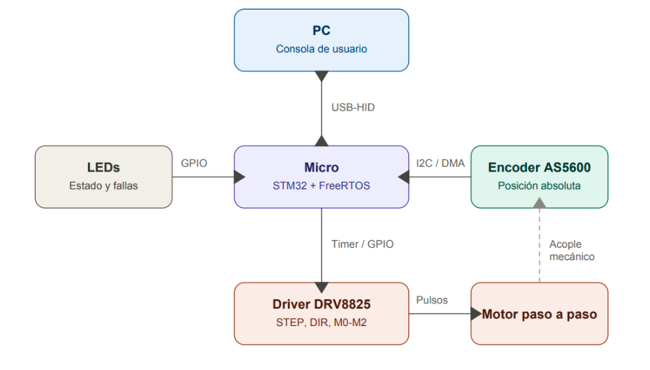

# Implementación de un Servo-motor de Alta Precisión mediante STM32 y FreeRTOS con Arquitectura Modular Orientada a Tareas

**Informe Final de Proyecto — Modalidad Defensa de Proyecto**
Ricardo Jeiel Arguello

---

## 1. Título y Resumen

**Título:** Implementación de un servo-motor de alta precisión mediante STM32 y FreeRTOS con arquitectura modular orientada a tareas.

**Resumen:** El proyecto implementa un servo-motor de posición de lazo cerrado sobre un microcontrolador STM32 (firmware portable entre STM32F103 y STM32F411 mediante HAL), utilizando un motor paso a paso gobernado por un driver DRV8825 en configuración de 1/2 paso y un encoder magnético absoluto AS5600 (12 bits, 4096 posiciones por vuelta) como sensor de realimentación. La arquitectura de software, sobre FreeRTOS, distribuye el trabajo en seis tareas concurrentes: adquisición del sensor por I2C con DMA, cálculo de control PID en punto fijo Q16, generación de movimiento sobre el driver, recepción y envío de telemetría por USB-HID, y supervisión del sistema. El sistema garantiza la recuperación automática de la posición ante perturbaciones externas, priorizando el determinismo del lazo cerrado de 3 ms. Se resolvieron durante el desarrollo problemas de oscilación sostenida cerca del setpoint y de sesgo de posición en ángulos negativos, ambos con diagnóstico técnico y solución documentados.

---

## 2. Objetivos del Proyecto

### Objetivo General

Implementar un servo-motor de posición basado en un motor paso a paso, controlado mediante una interfaz de consola USB-HID, que garantice precisión mecánica y estabilidad dinámica mediante el cumplimiento estricto de plazos de ejecución en un entorno de tiempo real (FreeRTOS).

### Objetivos Específicos

- **Determinismo en la adquisición:** lectura periódica del sensor AS5600 mediante DMA, eliminando el bloqueo de CPU durante la transferencia I2C.
- **Precisión del control:** error de estado estacionario acotado por la resolución mecánica del motor (0.9° por paso en 1/2 step), sin oscilación sostenida alrededor del setpoint.
- **Latencia de respuesta:** tiempo entre llegada de un comando USB-HID y actualización del movimiento del motor acotado y consistente.
- **Eficiencia de concurrencia:** lazo de control PID operando a 3 ms de período sin que la comunicación USB o el monitoreo provoquen incumplimientos de plazo.
- **Estabilidad dinámica:** eliminación de la oscilación sostenida mediante filtrado de la señal de posición y zona muerta (deadband) dimensionada según la resolución física del actuador.
- **Supervisión:** manejador de errores capaz de señalizar por LED qué tarea originó la falla.

---

## 3. Descripción Funcional del Sistema

El sistema opera como un servo-motor de lazo cerrado. La PC envía un setpoint de posición en grados mediante USB-HID; el sistema adquiere la posición real vía el sensor magnético AS5600, calcula el error respecto al setpoint, procesa dicho error mediante un algoritmo PID en punto fijo Q16 y actúa sobre el driver DRV8825 mediante señales de pulso (STEP), dirección (DIR) y configuración de pasos (M0-M2).

**Entradas:**
- Sensor AS5600 — posición angular absoluta vía bus I2C, con transferencia por DMA.
- Consigna de usuario — setpoint de posición en grados, enviado por USB-HID (OUT report).

**Salidas:**
- Driver DRV8825 — pulsos STEP generados por Timer (PWM con CCR fijo en 10), dirección por DIR, resolución de microstepping fija en 1/2 paso vía M0-M2.
- Telemetría — posición absoluta en grados, velocidad en RPM, cantidad de rotaciones y status del sistema, enviados por USB-HID (IN report).
- LEDs de estado — señalización de actividad y fallas mediante el manejador de errores de Monitor_Task.



---

## 4. Arquitectura de Software y Diseño en FreeRTOS

El firmware se estructura en seis tareas FreeRTOS interconectadas por colas, un mutex y notificaciones de tarea. El flujo de datos crítico (lazo de control) se ejecuta con un período de 3 ms.

### Identificación de Tareas

| Tarea | Función | Prioridad |
|---|---|---|
| Driver_Task | Conversión de RPM a registro ARR del Timer; manejo de DIR y pulsos STEP. | 7 |
| Control_Task | Cálculo del error, PID en punto fijo Q16 con deadband, traducción a RPM objetivo. | 6 |
| *(Timer Daemon Task — FreeRTOS)* | *Tarea interna del kernel; ejecuta el callback del software timer de 3 ms que dispara la transferencia DMA del sensor. No es una tarea propia del proyecto.* | *5* |
| Sensor_Task | Lectura del AS5600 vía I2C/DMA; filtrado exponencial de la posición; publicación del dato a través de mutex. | 4 |
| Input_HID_Task | Recepción de setpoints de posición desde la PC vía USB-HID. | 3 |
| Output_HID_Task | Empaquetado y envío de telemetría hacia la PC vía USB-HID. | 2 |
| Monitor_Task | Supervisión de stack, CPU libre, heartbeat de LEDs y manejador de errores (ENABLE). | 1 |

### Sincronización y Comunicación (IPC)

- **Notificaciones de tarea (xTaskNotifyFromISR):** despiertan a Sensor_Task al completarse la transferencia DMA del I2C, y a Input_HID_Task al llegar un reporte HID. Reemplazan a los semáforos binarios del diseño original por tener menor sobrecarga al no requerir una estructura independiente en el heap de FreeRTOS.
- **Mutex:** protege la copia de la estructura de datos del sensor (posición/ángulo/vueltas) dentro de Sensor_Task, evitando lecturas inconsistentes durante la actualización del dato para monitorizar y debbugear.
- **Colas (Queues):** Queue1_ComHandle (int32_t) transporta el setpoint de posición desde Input_HID_Task hacia Control_Task. Queue2_SensorControl (EncoderData_t) transporta el dato completo del sensor desde Sensor_Task hacia Control_Task. Queue4_SensorOutputHID (EncoderData_t) transporta el mismo tipo de dato desde Sensor_Task hacia Output_HID_Task para la telemetría. Queue3_PosHandle (int32_t) transporta el comando calculado por Control_Task hacia Driver_Task.

### Manejo de Interrupciones (ISRs)

El evento de adquisición del sensor está gobernado por un software timer de FreeRTOS configurado a un período de 3 ms. Al vencer dicho timer, se inicia la transferencia DMA del bus I2C hacia el AS5600. La interrupción de "DMA Transfer Complete" notifica a Sensor_Task (vía xTaskNotifyFromISR), momento en el cual la CPU retoma el dato ya disponible en RAM sin haber estado bloqueada durante la transferencia. Las interrupciones del endpoint USB (recepción de OUT report) notifican de forma análoga a Input_HID_Task.


---

## 5. Decisiones de Diseño

Esta sección documenta las decisiones de diseño más relevantes del proyecto, junto con la justificación técnica que llevó a cada una.

### 5.1 Separación en seis tareas independientes

El firmware se diseñó con tareas separadas por responsabilidades distintas en lugar de un único ciclo principal, por tres razones aplicadas en simultáneo.

La primera fue aislar el lazo crítico de control (Sensor_Task, Control_Task, Driver_Task) de las tareas de comunicación y supervisión, para garantizar que el período de 3 ms del PID no se vea afectado por el procesamiento USB o las operaciones de diagnóstico. Estas tres tareas tienen las prioridades más altas del sistema precisamente por eso.

La segunda fue separar la recepción de comandos (Input_HID_Task) del envío de telemetría (Output_HID_Task). Si ambas funciones corrieran en la misma tarea, el procesamiento de un reporte entrante podría bloquear o retrasar el flujo de datos de telemetría hacia la PC. Tenerlas separadas permite que el scheduler de FreeRTOS las gestione de forma independiente.

La tercera fue aislar Monitor_Task en la prioridad más baja del sistema. Las tareas de diagnóstico (verificación de stacks, heartbeat de LEDs, manejo del error handler) son las menos críticas en términos de tiempo real. Si corrieran en la misma tarea que el control o la comunicación, podrían introducir jitter impredecible en las operaciones de mayor prioridad.

### 5.2 Uso de colas entre tareas específicas

El mecanismo de paso de datos entre tareas se eligió usando colas de FreeRTOS en lugar de variables globales protegidas por mutex para cada transferencia de dato. La razón principal es que las colas evitan condiciones de carrera entre el productor y el consumidor sin necesidad de adquirir explícitamente un mutex en cada acceso: el mecanismo de cola garantiza la atomicidad de la operación de enqueue/dequeue internamente.

Cada cola conecta exactamente un productor con un consumidor y transporta un tipo de dato específico, lo que hace explícito en el código el flujo de información entre tareas.

### 5.3 Notificaciones de tarea en lugar de semáforos binarios

El diseño original planteaba semáforos binarios para sincronizar las ISRs con las tareas. Durante la implementación se reemplazaron por notificaciones de tarea (xTaskNotifyFromISR / xTaskNotifyWait). Las notificaciones no requieren una estructura de datos separada en el heap de FreeRTOS: cada tarea ya tiene un valor de notificación integrado en su TCB (Task Control Block). En un sistema con memoria acotada (STM32F103/F411), eliminar estructuras de semáforo que no aportan funcionalidad adicional reduce el consumo de heap y simplifica la inicialización del sistema.

### 5.4 DMA para la adquisición del sensor

La lectura del AS5600 se configuró para usar DMA en lugar de I2C bloqueante o I2C por interrupción con buffer manual. Con DMA, la CPU inicia la transferencia y queda libre hasta que el hardware completa la copia del dato a RAM y dispara la interrupción "DMA Transfer Complete". Dado que el sistema corre un lazo de control cada 3 ms con seis tareas concurrentes, no bloquear la CPU durante la adquisición del sensor es una condición necesaria para que las tareas de mayor prioridad no pierdan tiempo de ejecución esperando datos del periférico.

### 5.5 Software timer de FreeRTOS en lugar de TIM1 por hardware

El disparo periódico de la adquisición del sensor se implementó con un software timer de FreeRTOS en lugar de un timer de hardware del STM32. Los timers de hardware del STM32 están diseñados para resoluciones del orden de microsegundos, y son recursos limitados que ya están comprometidos para otras funciones del sistema (como la generación de pulsos STEP del motor). Para un período de 3 ms, un software timer de FreeRTOS cumple la misma función sin consumir un periférico de hardware dedicado.

### 5.6 Configuración fija de 1/2 paso en lugar de microstepping variable

El preinforme planteaba una lógica de microstepping dinámico que conmutara automáticamente entre paso completo, 1/2 y 1/4 de paso según la magnitud del error. Esta idea se descartó tras analizar la relación entre la resolución del encoder y la del motor.

El encoder AS5600 tiene una resolución de 12 bits: 4096 posiciones por vuelta, equivalente a 0.088° por tick. El motor en 1/2 paso tiene 400 pasos por vuelta, equivalente a 0.9° por paso. La resolución del encoder es aproximadamente diez veces más fina que la resolución mecánica del motor incluso en 1/2 paso. En consecuencia, el factor limitante de la precisión final no es la cantidad de pasos sino la resolución mecánica mínima del motor, y una zona muerta dimensionada en al menos medio paso físico resuelve el problema sin necesidad de conmutar entre configuraciones. Además, reducir el microstepping implica una caída de torque disponible que puede impedir al motor superar su fuerza de retención magnética natural, generando más inestabilidad que la que resuelve.

### 5.7 Jerarquía de prioridades de tareas

La asignación de prioridades se diseñó considerando tres factores: el orden del pipeline crítico (Sensor → Control → Driver), la posición de la Timer Daemon Task del kernel de FreeRTOS en la jerarquía, y la medición empírica del tiempo de cómputo de las tareas más costosas.

La Timer Daemon Task del kernel está configurada en prioridad 5 (configTIMER_TASK_PRIORITY) y es la que ejecuta el callback del software timer de 3 ms que inicia la adquisición. Se midió que Control_Task y Driver_Task juntas consumen una fracción significativa del período de 3 ms (un intento de reducir el período a 1 ms resultó en incumplimiento de plazos). Por eso se ubicó a estas dos tareas por encima de la Daemon Task (prioridades 6 y 7): una interrupción de la Daemon Task a mitad de la escritura de los registros del Timer (ARR/DIR) es más costosa para la estabilidad mecánica que un retraso de microsegundos en el disparo del muestreo. Sensor_Task se ubicó debajo de la Daemon Task (prioridad 4) porque su disparo real depende de la interrupción de hardware "DMA Transfer Complete", inmune a las prioridades de FreeRTOS, y su carga de trabajo es liviana.

La jerarquía final es: Driver_Task (7) > Control_Task (6) > Timer Daemon Task (5, kernel) > Sensor_Task (4) > Input_HID_Task (3) > Output_HID_Task (2) > Monitor_Task (1). Input_HID_Task se redujo de prioridad 4 a 3 y se verificó mediante prueba directa que esta reducción no introduce retardo perceptible en la respuesta a comandos del usuario.

### 5.8 Zona muerta (deadband) dimensionada por resolución mecánica del motor

El problema de oscilación sostenida cerca del setpoint (amplitud ≈1°, velocidad ≈5.5°/s) se identificó como consecuencia directa de pedir al lazo una tolerancia más fina que lo que el motor puede físicamente resolver en un solo movimiento. Con 400 pasos por vuelta en 1/2 paso, el mínimo movimiento posible es 0.9°. El PID, corriendo cada 3 ms sin zona muerta, interpretaba cualquier error menor a 0.9° como corrección necesaria, ordenaba un paso, el motor se pasaba del setpoint, el PID ordenaba un paso en sentido contrario, y el ciclo se repetía indefinidamente.

La solución fue introducir una zona muerta en Control_Task: cuando el error en ticks es menor a un umbral equivalente a medio paso físico (aproximadamente 5 ticks, correspondiente a 0.44°), la salida del PID se fuerza a cero. Este umbral se eligió en función de la resolución mecánica del motor, para que el sistema reconozca como "posición alcanzada" cualquier error que no puede corregir con el movimiento mínimo posible del actuador.

---

## 6. Interfaz USB-HID y Portabilidad

### 6.1 Estructura del paquete de telemetría (Micro → PC)

El microcontrolador envía telemetría hacia la PC mediante un reporte HID de entrada con la siguiente estructura:

```c
typedef struct __attribute__((packed)) {
    uint8_t  reportID;     // Siempre 0x01 para reportes de salida del micro
    int32_t  position;     // Posición absoluta en grados (punto fijo, escala 1°)
    int32_t  velocity;     // Velocidad en RPM
    int16_t  rotations;    // Cantidad de rotaciones completas
    uint8_t  status_flags; // Flags de estado del sistema
} HID_Report_t;
```

El campo `status_flags` codifica el estado interno del sistema y puede usarse para detectar condiciones de error o de movimiento activo desde la aplicación en la PC.

### 6.2 Estructura del paquete de comando (PC → Micro)

Para enviar un setpoint de posición hacia el microcontrolador, la aplicación en la PC debe construir un reporte HID de salida con la misma estructura `HID_Report_t`, estableciendo el `reportID` en `0x02` y colocando el setpoint deseado en grados en el campo `position`. Los demás campos son ignorados por el firmware al recibir este tipo de reporte:

```c
HID_Report_t cmd = {0};
cmd.reportID = 0x02;
cmd.position = setpoint_en_grados;
// Enviar cmd como OUT report al endpoint HID del dispositivo
```

### 6.3 Portabilidad a otros microcontroladores

El firmware está diseñado para ser portable a cualquier microcontrolador STM32 compatible con HAL y FreeRTOS. Para adaptar el sistema a una placa distinta, los pasos necesarios son:

**1. Configurar un timer base a 1 MHz mediante el preescaler.** Este timer es el que FreeRTOS utiliza como base de tiempo. El valor del preescaler depende del reloj del sistema de la placa destino y debe ajustarse en el archivo de configuración del proyecto de STM32CubeIDE para que el timer base quede a exactamente 1 MHz.

**2. Mapear los periféricos en `board_config.h`.** Este archivo centraliza todas las asignaciones de hardware: pines de STEP, DIR, M0-M2, ENABLE del driver, la instancia de I2C conectada al AS5600, el timer de generación de pulsos STEP, y los pines de los LEDs de estado. Modificar este archivo es suficiente para redirigir el firmware a otro pinout sin tocar la lógica de control.

**3. Llamar a `AppInit` desde el main del workspace del microcontrolador** como primera y única tarea creada antes de arrancar el scheduler:

```c
BaseType_t status;
status = xTaskCreate(AppInit, "TaskCreate", 256, NULL, 10, NULL);
if (status == pdFAIL) {
    Error_Handler();
}
vTaskStartScheduler();
```

`AppInit` se encarga de crear las seis tareas del sistema, inicializar las colas, el mutex y el software timer, y configurar los periféricos definidos en `board_config.h`. El workspace del microcontrolador no necesita conocer ningún detalle interno del firmware más allá de esta llamada.

---

## 7. Resultados y Validación

### Estado de implementación

El sistema está implementado y validado en su totalidad. El lazo de control cerrado (Sensor → Control → Driver) opera de forma estable, la comunicación USB-HID bidireccional con la PC funciona correctamente, y Monitor_Task supervisa el sistema en tiempo real con su manejador de errores activo.

### Metodología de validación

Las pruebas se realizaron en dos etapas. Primero, cada tarea se validó de forma individual mediante depuración paso a paso, verificando su comportamiento aislado. Luego, el conjunto de las seis tareas se validó corriendo de forma concurrente sobre FreeRTOS, utilizando estructuras de depuración desarrolladas específicamente para este propósito (motor_debug, timer_debug, debug_stats), que permiten observar en tiempo real el estado del motor, los timers y estadísticas generales del sistema mientras las tareas operan en conjunto.

### Periféricos validados

- **I2C + DMA (AS5600):** lectura periódica sin bloquear la CPU; filtro pasabajos exponencial validado sobre la señal de posición.
- **Timer de generación de pasos (STEP):** PWM con CCR fijo en 10 y ARR variable; movimiento del motor validado en 1/2 paso a distintas velocidades.
- **GPIO de dirección (DIR) y microstepping (M0-M2):** validados en configuración fija de 1/2 paso.
- **USB-HID (Input y Output):** comunicación bidireccional validada; envío de setpoints desde la PC y recepción de telemetría (posición absoluta, velocidad, rotaciones, status) en tiempo real.

### Problemas resueltos durante el desarrollo

- **Pérdida de torque por microstepping:** 1/8 de paso producía pérdida de pasos a alta velocidad por caída de torque incremental; se consolidó la operación en 1/2 paso.
- **Sesgo de posición en ángulos negativos (~899°):** error de redondeo en la conversión de ticks a grados que truncaba siempre hacia valores crecientes, ignorando el signo. En setpoints negativos generaba un offset sistemático que el lazo interpretaba como posición alcanzada sin estarlo. Se corrigió aplicando redondeo simétrico respecto al signo.
- **Oscilación sostenida en el setpoint (amplitud ≈1°):** diagnosticada como consecuencia de pedir al lazo una tolerancia más fina que la resolución mecánica mínima del motor (0.9° por paso). Se corrigió mediante filtro pasabajos exponencial sobre la posición leída en Sensor_Task y zona muerta (deadband) en Control_Task dimensionada en al menos medio paso físico.

### Mejora opcional no implementada

La lógica específica de detección automática de bloqueo mecánico (stall) no fue implementada por restricciones de tiempo. La infraestructura necesaria ya existe: el pin de ENABLE está mapeado y Monitor_Task cuenta con el manejador de errores. La incorporación de esta detección sobre la base existente es directa en una etapa posterior.

---

## 8. Conclusiones

El proyecto demostró que es posible implementar un servo-motor de precisión sobre hardware de bajo costo (STM32 + DRV8825 + AS5600) utilizando FreeRTOS como sistema operativo de tiempo real, con un diseño modular que separa claramente las responsabilidades de cada tarea y garantiza el determinismo del lazo de control.

Las decisiones de diseño más relevantes del proyecto fueron las que surgieron de la intersección entre los límites del hardware y los requisitos del sistema de tiempo real: la elección del período de muestreo de 3 ms como compromiso entre el tiempo de cómputo del pipeline y la estabilidad del lazo, la jerarquía de prioridades que incorpora la Timer Daemon Task como factor explícito, y el dimensionamiento del deadband en función de la resolución mecánica real del motor en lugar de un valor empírico arbitrario.

El diagnóstico y resolución del problema de oscilación sostenida ilustra un patrón frecuente en sistemas de control embebidos: la causa raíz no era un problema de sintonía del controlador sino una incompatibilidad entre la tolerancia que el algoritmo intentaba alcanzar y la resolución que el actuador podía físicamente ofrecer. Identificar ese tipo de problema requiere entender la cadena completa del sistema, desde el sensor hasta el actuador, y no solo el algoritmo de control en sí.

El firmware portable entre STM32F103 y STM32F411 mediante HAL resultó una decisión acertada para el desarrollo: permitió validar el sistema en distintas plataformas sin cambios en la lógica de control ni en la arquitectura de tareas.